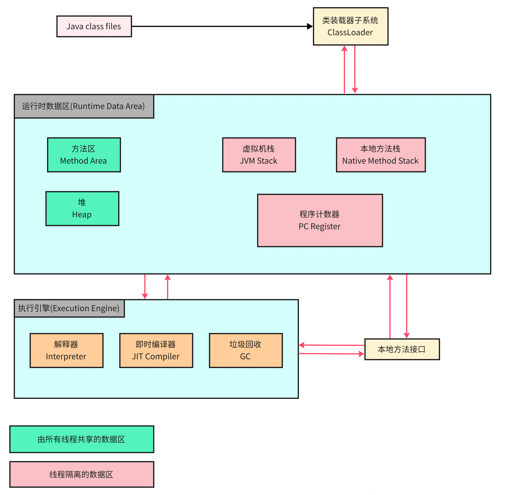

# JVM运行时数据区域

致敬作者

| 作者名称          | 参考地址                                                     | 参考详情      |
| ----------------- | ------------------------------------------------------------ | ------------- |
| hmb↑              | https://blog.csdn.net/qq_48721706/article/details/128170423  | JVM内存模型图 |
| 情迷IntelliJ IDEA | https://blog.csdn.net/phg739436146/article/details/108412116 | JVM本地方法栈 |
| iqqcode           | [iqqcode-CSDN博客](https://iqqcode.blog.csdn.net/?type=blog) JVM相关文章 | JVM           |

**JVM内存模型**如下：



## 1  程序计数器 PC Register

### 1.1 定义

程序计数器是一块很小的内存空间，可以当作是当前线程所执行字节码的新号指示器；JVM中的程序计数器是对物理PC寄存器的模拟抽象。

- 作用:

  记住下一条 JVM 指令的执行地址。执行引擎的解释器在工作时就是通过改变程序计数器来选取下一条需要执行的字节码指令。程序控制流的指示器，分支、循环、跳转异常处理、线程恢复等基础功能都需要依赖程序计数器完成。

- 特点:
  - 线程私有：Java 虚拟机的多线程是通过 CPU 分配执行时间来对线程轮流切换执行的 ---> 同一时刻，一个处理器只会执行一个线程中的指令。即PC计数器存储的是当前线程指令的地址，即线程私有，则生命周期与线程生命周期一致。
  - 执行本地方法时，PC计数器无法记录，因为可能是C / C++代码，则是未指定值(Undefined);
  - 不会存在内存溢出：占用空间小，存放的都是地址，不会被垃圾回收。

可参考文章：https://blog.csdn.net/weixin_43232955/article/details/107370810

### 1.2 问题

1 为什么使用PC寄存器记录当前线程的执行地址呢？

​	**记录上下文环境**。当线程进行上下文切换发生时，需要由操作系统保存当前线程的状态，并恢复另一个线程的状态。Java 中对应程序计数器 --- 记住下一条JVM指令的执行地址。

2 PC 计数器为什么会被设定为线程私有？

​	**为了能够准确的记录各个线程正在执行的当前字节码指令的地址**。因为 同一时刻，一个处理器只会执行一个线程中的指令。

## 2 虚拟机栈 JVM Stack

可参考文章：https://blog.csdn.net/weixin_43232955/article/details/107371310

### 2.1 定义

- 每个线程运行时所需要的内存，称为虚拟机栈
- 每个栈由多个栈帧（Frame）组成，对应着每次方法调用时所占用的内存
- 每个线程只能有一个活动栈帧，对应着当前正在执行的那个方法

### 2.2 理解

- **线程请求的栈深度大于虚拟机所允许的深度，抛出StackOverflowError；**
- **虚拟机栈扩展时无法申请到足够的内存，抛出OutOfMemoryError。**

### 2.3 StackOverflowError

```Java
/**
 * 栈超出最大深度：StackOverflowError
 * VM args: -Xss128k
 **/
public class StackSOF {
    private int stackLength = 1;
    public void stackLeak(){
        stackLength++;
        stackLeak();
    }
    public static void main(String[] args) {
        StackSOF stackSOF = new StackSOF();
        try {
            stackSOF.stackLeak();
        } catch (Throwable e) {
            System.out.println("当前栈深度:" + stackSOF.stackLength);
            e.printStackTrace();
        }
    }
}
```

```Java
java.lang.StackOverflowError
当前栈深度:30170
at cn.itcast.jvm.StackSOF.stackLeak(StackSOF.java:11)
at cn.itcast.jvm.StackSOF.stackLeak(StackSOF.java:11)

方法递归调用，造成深度过深，产生异常
```

### 2.4 OutOfMemoryError

(谨慎使用，会卡死电脑)

```Java
/**
 * 栈内存溢出： OOM
 * VM Args: -Xss2m
 **/
public class StackOOM {
    private void dontStop(){
        while (true){
        }
    }
    public void stackLeakByThread(){
        while(true){
            Thread t = new Thread(new Runnable() {
                public void run() {
                    dontStop();
                }
            });
            t.start();
        }
    }
    public static void main(String[] args) {
        StackOOM stackOOM = new StackOOM();
        stackOOM.stackLeakByThread();
    }
}
```

```Java
Exception in thread "main"  java.lang.OutOfMemoryError:unable to create new native thread
```

### 2.5 辨析

| 问题                         | 答案                                                         |
| ---------------------------- | ------------------------------------------------------------ |
| 1 垃圾回收是否设计栈内存？   | 不会，栈帧内在每次方法结束后都会弹出栈，自动回收掉           |
| 2 占内存分配越大越好？       | 不对，因为物理内存是一定的，栈内存越大，可以支持更多的递归调用，但是可执行的线程数目就会越少。 |
| 3 方法内的局部变量是否安全？ | 若是采用了引用对象，并且能够逃离方法的作用范围，则需要考虑线程安全 |

针对问题3案例：

```Java
//线程安全, 引用未能逃离方法m1
public void m1(){
    StringBuilder sb = new StringBuilder();
    sb.append("1")
            .append("2")
            .append("3");
}
//需考虑线程安全, sb为引用, 逃离m2控制
public void m2(StringBuilder sb){
    sb.append("1")
            .append("2")
            .append("3");
}
//需考虑线程安全, sb为引用, 逃离m3控制
public StringBuilder m3(){
    StringBuilder sb = new StringBuilder();
    sb.append("1")
            .append("2")
            .append("3");
    return sb;
}
```

## 3 本地方法栈 Native Method Stack

可参考文章：https://blog.csdn.net/phg739436146/article/details/108412116

### 3.1 定义

1 定义：在 Java 的 JVM 中，本地方法栈是用于支持本地方法调用的栈。

2 本地方法定义：本地方法通常指非 Java 语言(如 C / C++) 编写的，并通过 JNI 与 Java 交互。

3 特点：当某个线程调用本地方法时，它就进入了一个全新的且不受虚拟机限制的世界，且拥有和虚拟机相同的权限。

- 本地方法可以通过本地方法接口来访问虚拟机内部运行时数据区；
- 可直接使用本地处理器中的寄存器；
- 可直接从本地内存的堆中分配任意数量的内存；

## 4 堆 Heap

可参考文章：https://blog.csdn.net/weixin_43232955/article/details/107410903

### 4.1 定义

定义：堆用来存储 Java 对象实例，在虚拟机启动时被创建。

特点： 

- Java 堆是被线程共享的，且堆中对象都需要考虑线程安全的问题；
- Java 堆可以处于物理上不连续的内存空间中，只要求逻辑上连续即可；
- Java 堆是垃圾收集器管理的主要区域，因此很多时候被称为 “GC" 堆。且现在收集器基本采用分代回收的算法，可细分为：新生代(Eden, Survivor(S0, S1) ) 、老年代Tenured、元空间 Meta Space。

### 4.2 堆大小

1 堆空间大小设置：

- `-Xms`(memory start)：堆区起始内存
- `-Xmx`(memory max)：堆区最大内存

通常会将 -Xms和-Xmx两个参数配置相同的值，其目的是为了在GC后，不需要重新分配计算堆区的大小，从而提高性能。

2 堆空间默认大小：

- 初始内存大小：物理内存的 1 / 64；
- 最大内存大小：物理内存的 1 / 4；

3 堆内存：

- 内存泄漏( Memory Leak ): 一个无用的对象，应该被回收，却因为某种原因一直未被回收；
- 内存溢出( Memory OverFlow ): 对象过多，这个时候内存应该不够用了。

4.3 堆内存诊断工具

- JPS：查看当前系统中有哪些 Java 进程；
- Jmap：查看堆内存中占用情况； jmap - heap    --->  进程id；
- Jconsole：图形界面多功能监测工具，可连续监测；

## 5 方法区 Method Area

可参考文章：https://blog.csdn.net/weixin_43232955/article/details/107411378

### 5.1 定义

1 定义

方法区用于存放类结构信息, 主要任务是管理 Java 类的运行时数据。方法区是所有线程共享的内存区域，通常被称为永久代(PremGen) 和元空间(Metaspace)。

2 作用

- 存储类结构：方法区存储已加载的类和接口的信息。它包括类的全名、父类、实现的接口、字段和方法的定义等。
- 常量池：运行时常量池是方法区的一部分，用于存储编译时生成的各种字面量和符号引用，包括字符串常量、类引用等。
- 方法数据：包括方法的字节码、局部变量表、操作数栈等，用于在方法执行时提供必要的信息。
- 字段数据：存储类字段（静态变量）的数据和相关信息。

3 特点

- 共享：方法区被所有线程共享，考虑线程安全；
- 生命周期：方法去在 JVM 启动时创建，在 JVM 关闭时销毁。随着类的加载和卸载而动态变化。
- 垃圾回收：方法区也进行垃圾回收，但与堆的垃圾回收不同，主要回收无用的类信息和常量池中的垃圾数据。
- 内存限制：具体取决于JVM的实现。旧版本 JVM 永久代(PermGen) 有固定大小限制，新版 JVM 元空间(MetaSpace) 通常依赖于本地内存。

4 组成

- 运行时常量池：运行时常量池是方法区的一部分，包含了编译期生成的字面量和符号引用，如字符串常量、类和方法的引用。
- 类信息：包括类的全名、父类信息、实现的接口、字段和方法的描述等。这些信息用于在运行时检查类的结构和进行方法调用。
- 字段和方法数据：包括字段的名称、类型以及方法的字节码、局部变量表、操作数栈等。这些数据在方法调用和字段访问时被使用。
- 类加载器：方法区也涉及类加载器的使用。每个类加载器负责加载其创建的类的信息，并在方法区中存储相关数据。